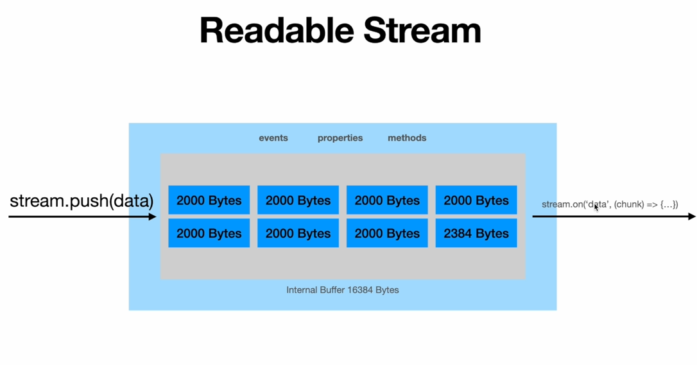
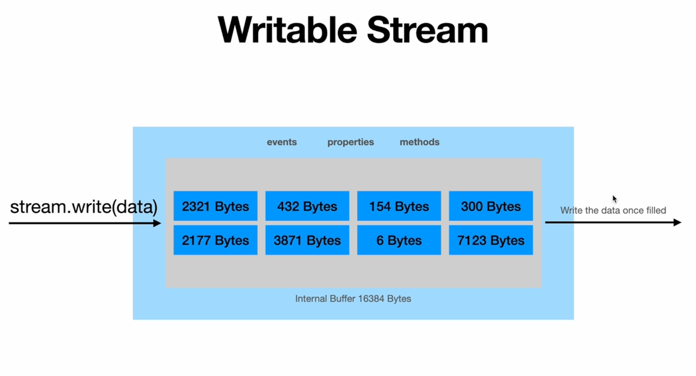
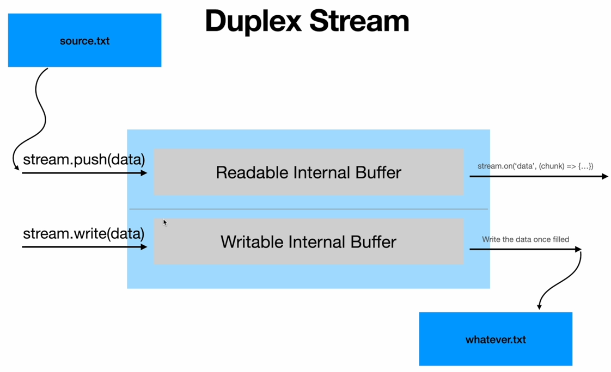
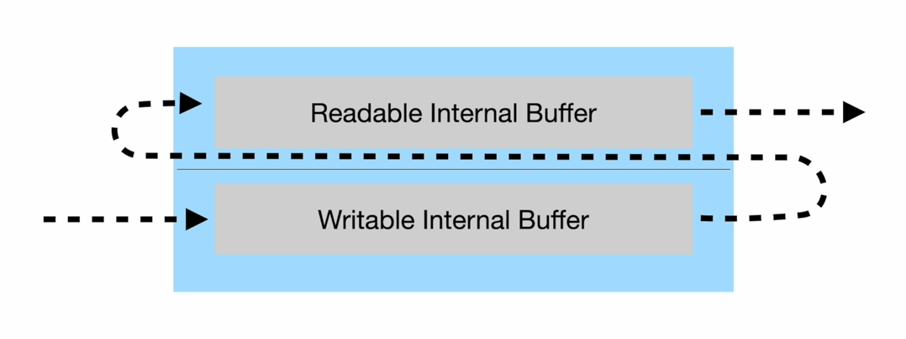

- Streams help in dealing with flowing data.
- We don't move large data at once. Instead we do it in smaller chunks.

## Types of Streams:

1. **Writable**: We write to it.
   

   - By default for writeable the size of chunks in stream is a buffer of 16KB .
   - We fill the buffer and then let the stream write it to the destination.
   - And only after stream has drained the buffer do we begin to write again. (This prevents back pressure.).
   - Back pressure is caused when we fill the internal buffer and still keep writing to it.
   - Node will keep the extra data being written in memory before it drains the internal buffer and fills it with the extra data and writes it again.
   - Back pressure can cause performance issues as it increases memory consumption to a very significant degree.

2. **Readable**: We read from it.
   

   - Internal buffer size 64KB by default.
   - Only starts reading data if we listen to 'data' event of the stream.

3. **Duplex**: Both readable and writable. Consequently it uses two buffers internally. One to read other to write.
   
   
   - It has 2 separate internal buffers.
   - One is used for writing and other is used for read.

4. **Transform**: Similar to _duplex_ but it transforms the data.
   

   - Same as duplex stream.
   - Data written in to the writeable buffer is transformed and pushed into readable buffer.

## Creating Custom Streams

| Use-case                                      | Class     | Method(s) to implement                         |
| --------------------------------------------- | --------- | ---------------------------------------------- |
| Reading only                                  | Readable  | `_read()`                                      |
| Writing only                                  | Writable  | `_write()`, `_writev()`, `_final()`            |
| Reading and writing                           | Duplex    | `_read()`, `_write()`, `_writev()`, `_final()` |
| Operate on written data, then read the result | Transform | `_transform()`, `_flush()`, `_final()`         |
